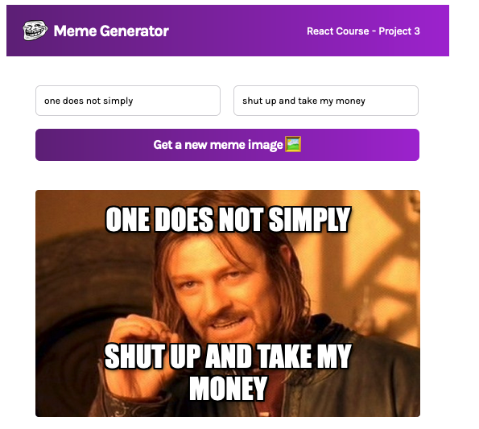

# Meme Generator

Load a random meme image from [Imgflip API](https://imgflip.com/api) and add your own caption.

A project for [Scrimba's Learn React for Free course](https://scrimba.com/learn/learnreact/). Design by Scrimba. All code is my own.

# Technologies Used

- [React](https://reactjs.org/)
- [Create React App](https://create-react-app.dev/)
- [TypeScript](https://www.typescriptlang.org/)
- [Tailwind CSS](https://tailwindcss.com/)
- [Imgflip API](https://imgflip.com/api)
- [Fetch API](https://developer.mozilla.org/en-US/docs/Web/API/Fetch_API)

# Installation and Setup

Clone down this repository. You will need node and npm installed globally on your machine.

Installation:

`npm install`

To Run Test Suite:

`npm test`

To Start Server:

`npm start`

To Visit App:

`localhost:3000`

# Issues

Doesn't work with the more complex meme types (e.g. memes that require inserting texts into the images itself, multi-panel memes, etc.).

# Contact

[Andrew Huntington](https://andrewhuntington.com)
